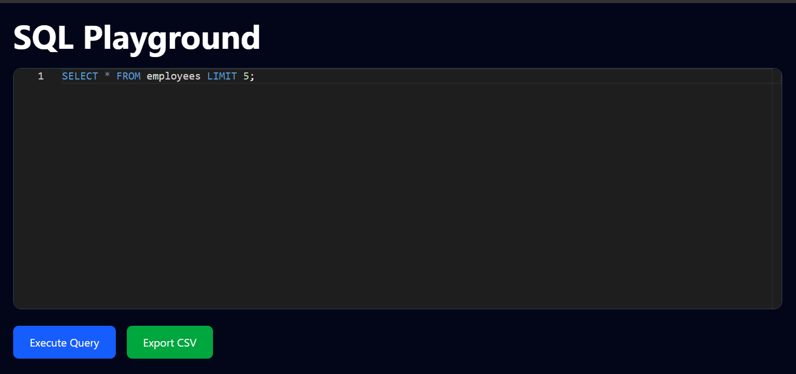
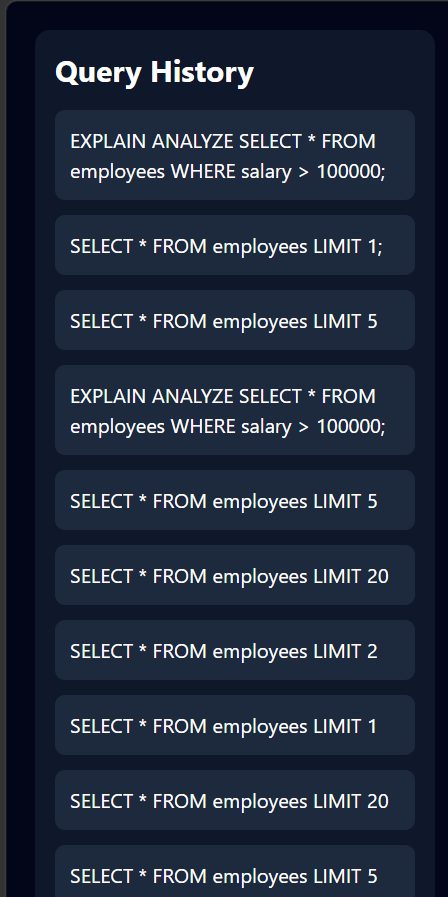
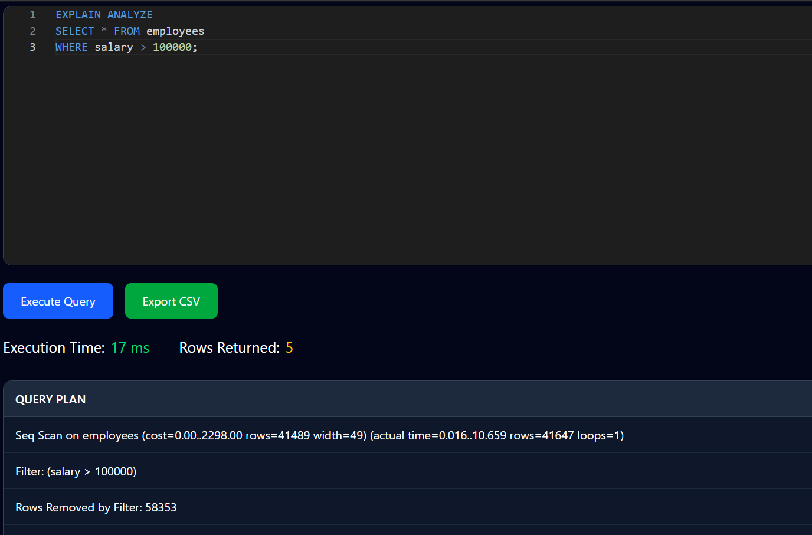

<div align="center">

# 🚀 SQL Playground

### A production-grade, browser-based SQL IDE for safe, read-only query execution at scale

[](https://openjdk.org/)
[](https://spring.io/projects/spring-boot)
[](https://www.postgresql.org/)
[](https://react.dev/)
[](https://www.docker.com/)
[](LICENSE)

**A SQLPad/DBeaver-style query playground demonstrating backend architecture, query safety engineering, and full-stack system design — built to operate on 100K+ records with sub-second analytical queries.**

[Demo](#-demo) • [Features](#-features) • [Architecture](#-system-architecture) • [Getting Started](#-getting-started) • [API Reference](#-api-reference)

</div>

---

## 📖 Overview

**SQL Playground** is a self-hosted, full-stack analytical query environment that lets users write and execute **read-only SQL** against a large PostgreSQL dataset directly from the browser, with an IDE-grade editing experience (Monaco), execution plan visualization (`EXPLAIN ANALYZE`), and exportable results — all while enforcing strict query-safety guardrails on the backend.

It was built to demonstrate real-world backend engineering concerns: **input validation, query sandboxing, performance instrumentation, and clean API design** — not just CRUD.

> **Why this project matters:** Most "SQL playground" demos trust the client. This one doesn't. Every query is parsed and validated server-side before it ever touches the database connection pool.

---

## 🎥 Demo

> Add screenshots or a GIF walkthrough here after uploading them to `/screenshots`.

| Home / Editor | Query History | Execution Plan |
|---|---|---|
|  |  |  |

---

## ✨ Features

### 🔧 Backend
| Capability | Description |
|---|---|
| **Dynamic SQL execution** | Executes arbitrary read-only SQL via `JdbcTemplate` with parameterized safety boundaries |
| **Query validation layer** | Whitelist-based parser allows only `SELECT`, `WITH` (CTEs), and `EXPLAIN ANALYZE` |
| **Destructive query firewall** | Hard-blocks `INSERT`, `UPDATE`, `DELETE`, `DROP`, `ALTER`, `TRUNCATE` before execution |
| **Global exception handling** | Centralized `@ControllerAdvice` for consistent, typed error responses |
| **Execution telemetry** | Captures query latency and row counts per request |
| **Query history persistence** | Every executed query is logged and retrievable |

### 🎨 Frontend
| Capability | Description |
|---|---|
| **Monaco-powered editor** | VS Code-grade SQL editing experience with syntax highlighting |
| **Live result grid** | Dynamically rendered tabular results for any query shape |
| **Query history sidebar** | One-click re-run of past queries |
| **CSV export** | Export any result set for offline analysis |
| **Dark-themed UI** | Built with Tailwind CSS for a clean, IDE-like feel |
| **Inline error surfacing** | SQL errors rendered contextually, not as raw stack traces |

### 🗄️ Data Layer
| Capability | Description |
|---|---|
| **100K+ row dataset** | Synthetic employee dataset generated via Java Faker |
| **Bulk CSV ingestion** | High-throughput data load via PostgreSQL `COPY` |
| **Dockerized PostgreSQL** | One-command, reproducible local database |
| **Query plan visualization** | Native `EXPLAIN ANALYZE` output for performance analysis |

---

## 🏗 System Architecture

```text
┌─────────────────────┐
│   React + Monaco     │   Client-side editor & result rendering
│   (Vite, Tailwind)   │
└──────────┬───────────┘
           │ REST (Axios / JSON)
           ▼
┌─────────────────────┐
│  Spring Boot REST    │   Controller layer — request/response mapping
│       Layer           │
└──────────┬───────────┘
           ▼
┌─────────────────────┐
│   Query Validator     │   Whitelist parser — rejects destructive SQL
│   (Security Boundary) │   before it reaches the DB connection
└──────────┬───────────┘
           ▼
┌─────────────────────┐
│    JdbcTemplate       │   Execution + metrics capture
└──────────┬───────────┘
           ▼
┌─────────────────────┐
│     PostgreSQL         │   100K+ row dataset, Dockerized
└─────────────────────┘
```

**Design principle:** the **Query Validator sits as a hard boundary** between the API layer and the database — every request is treated as untrusted input, regardless of source.

---

## 📂 Project Structure

```text
sql-playground/
│
├── backend/
│   ├── controller/        # REST endpoints
│   ├── service/            # Query execution + business logic
│   ├── dto/                 # Request/response contracts
│   ├── util/                # Query validation utilities
│   ├── exception/         # Global exception handlers
│   └── application.properties
│
├── frontend/
│   ├── src/
│   │   ├── components/
│   │   │   ├── SqlEditor.jsx
│   │   │   └── ResultTable.jsx
│   │   ├── App.jsx
│   │   └── main.jsx
│   └── package.json
│
└── screenshots/
```

---

## 📊 Dataset

A synthetic 100,000+ row employee dataset, generated with **Java Faker** and bulk-loaded into PostgreSQL via CSV import for realistic analytical query testing.

```sql
CREATE TABLE employees (
    id BIGSERIAL PRIMARY KEY,
    name VARCHAR(100),
    age INT,
    city VARCHAR(50),
    department VARCHAR(50),
    salary INT
);
```

---

## 🔒 Security Model

SQL Playground follows a **deny-by-default** execution policy. Only analytical, read-only statements are permitted:

| Statement | Status |
|---|---|
| `SELECT` | ✅ Allowed |
| `WITH` (CTE) | ✅ Allowed |
| `EXPLAIN ANALYZE` | ✅ Allowed |
| `INSERT` / `UPDATE` / `DELETE` | ❌ Blocked |
| `DROP` / `ALTER` / `TRUNCATE` | ❌ Blocked |

Validation happens **before** the query reaches the JDBC layer, so blocked statements never open a transaction against the database.

---

## 📈 Example Queries

<details>
<summary><strong>Basic Query</strong></summary>

```sql
SELECT * FROM employees LIMIT 10;
```
</details>

<details>
<summary><strong>Aggregation</strong></summary>

```sql
SELECT department, AVG(salary)
FROM employees
GROUP BY department;
```
</details>

<details>
<summary><strong>CTE</strong></summary>

```sql
WITH high_salary AS (
    SELECT *
    FROM employees
    WHERE salary > 100000
)
SELECT * FROM high_salary;
```
</details>

<details>
<summary><strong>Execution Plan</strong></summary>

```sql
EXPLAIN ANALYZE
SELECT *
FROM employees
WHERE salary > 100000;
```
</details>

---

## 🚀 Getting Started

### Prerequisites
- Java 21+
- Node.js 18+
- Docker

### 1. Clone the repository
```bash
git clone https://github.com/<your-username>/sql-playground.git
cd sql-playground
```

### 2. Start PostgreSQL (Docker)
```bash
docker run --name sql-playground-db \
  -e POSTGRES_PASSWORD=postgres \
  -e POSTGRES_DB=sql_playground \
  -p 5432:5432 -d postgres:15
```

### 3. Run the backend
```bash
cd backend
mvn spring-boot:run
```

### 4. Run the frontend
```bash
cd frontend
npm install
npm run dev
```

App will be available at `http://localhost:5173` (frontend) and `http://localhost:8080` (API).

---

## 📡 API Reference

| Method | Endpoint | Description |
|---|---|---|
| `POST` | `/api/query/execute` | Validates and executes a SQL query |
| `GET` | `/api/query/history` | Returns past executed queries |
| `GET` | `/api/query/export` | Exports last result set as CSV |

**Sample request**
```http
POST /api/query/execute
Content-Type: application/json

{
  "sql": "SELECT department, AVG(salary) FROM employees GROUP BY department"
}
```

**Sample response**
```json
{
  "columns": ["department", "avg_salary"],
  "rows": [["Engineering", 118500], ["Sales", 92300]],
  "rowCount": 2,
  "executionTimeMs": 42
}
```

---

## 🧪 Tech Stack

| Layer | Technology |
|---|---|
| **Backend** | Java 21, Spring Boot, JdbcTemplate |
| **Database** | PostgreSQL 15 |
| **Frontend** | React, Vite, Tailwind CSS, Axios, Monaco Editor |
| **Infra** | Docker |

---

## 🎯 Engineering Highlights

This project was built to demonstrate:

- **Defensive backend design** — treating all SQL input as adversarial by default
- **Query performance analysis** — using `EXPLAIN ANALYZE` to reason about execution plans at scale
- **Clean layered architecture** — controller → service → validator → data access separation
- **Full-stack integration** — typed REST contracts consumed by a reactive frontend
- **DevOps fundamentals** — reproducible, containerized database environments

---

## 📌 Roadmap

- [ ] Docker Compose for one-command full-stack startup
- [ ] Authentication & per-user query history
- [ ] Multi-dataset support
- [ ] Query bookmarking & saved queries
- [ ] Server-side pagination for large result sets
- [ ] Cloud deployment (AWS ECS / RDS)

---

## 👨‍💻 Author

**Jai Singh Katiyar**
Java Backend Developer — Spring Boot · PostgreSQL · Docker · AWS

[GitHub](#) • [LinkedIn](#)

---

<div align="center">

### ⭐ If you found this project useful, consider giving it a star — it helps a lot!

</div>
